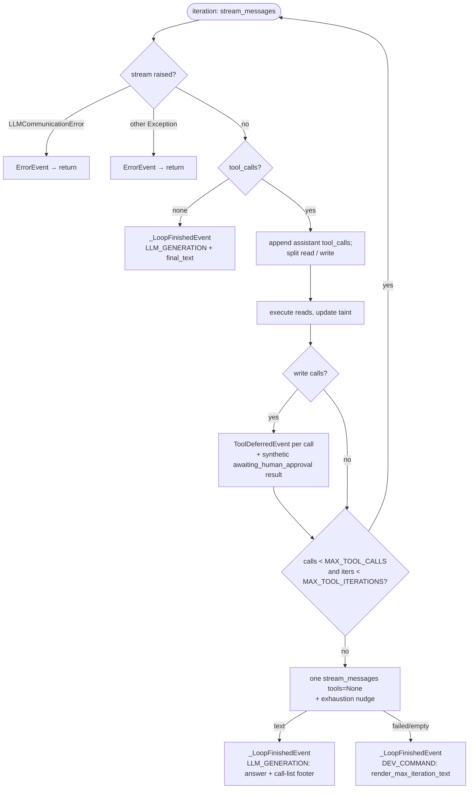

# Tool-use loop — exit paths & cleanup invariants

Design reference for the agent tool-use loop. The happy path (stream → tool
calls → execute → repeat) is readable in the code; what is *not* obvious is the
fan-out of **termination paths** and the obligations each one owes. Every bug
found in the May 2026 audit was a cell in this matrix that nothing checked.

Components:
- `ToolLoop.run` (`src/tools/tool_loop.py`) — one iteration of stream/execute.
- `ChatSystem._orchestrate` (`src/chat_system.py`) — drives the loop, owns the
  turn lifecycle (context var, persistence, taint, terminal event).

Coverage: `tests/integration/test_tool_loop_exit_invariants.py`.

## The five invariants

Every way the turn can end must satisfy all five:

| ID | Invariant |
|----|-----------|
| **I1** | `get_turn_context()` is `None` after the turn — the per-turn `ContextVar` must not leak into the next request sharing the event-loop context. |
| **I2** | The user turn is persisted (and retained through the backend) even when the model errors mid-flight. |
| **I3** | The assistant turn is persisted **iff** `final_text` is non-empty **and** `response_type == LLM_GENERATION`. |
| **I4** | `_conversation_taints[key]` is written with the correct sticky taint value. |
| **I5** | Exactly one terminal event is emitted (`DoneEvent` XOR `ErrorEvent`), with nothing trailing it. |

`recall_memory` (DP-113) reads the turn `ContextVar` to scope the memory bank,
so an **I1** violation is a cross-scope memory bug, not just hygiene: the next
turn in the same context recalls against the previous turn's persona/user/channel.

## ToolLoop.run terminal events

**Two guards sit in front of the park branch** (both inject a synthetic result and
create *no* second affordance):

- `pending_lookup` → `duplicate_of_pending`. The model re-proposed a write while
  an identical one is still waiting. Keyed on `write_call_identity` (name +
  canonicalized args, provider call id excluded — two re-proposals of the same
  action always carry different ids, which is exactly the case to catch). The
  suppressed call is emitted as a `_WriteDuplicateEvent` so the orchestrator can
  patch its history entry when the *original* resolves.
- `resolved_lookup` → `already_resolved` (DP-319). The model re-proposed a write
  that was already **executed or refused**. Backed by `Parked_Writes` rows within
  `PARK_REEXECUTION_GUARD_WINDOW` (15 min). **Continuation turns only** — the
  pending guard is structurally blind during a continuation (the park was already
  taken), which is precisely when the model re-reads its own tool span and
  re-proposes. Left running on ordinary turns it would answer a legitimate
  "restart that service again" with "that already happened", silently.

Because `MAX_TOOL_CALLS` is 15 (DP-297 raised it 5 → 10 — a parked write now
costs a step instead of ending the turn — and DP-335 moved the counter and
resized it), a turn can park several writes and still finish on ordinary text.

### Two limits, not one (DP-335)

`ToolLoop.run`'s `while` condition tests both:

| Constant | Counts | Purpose |
|---|---|---|
| `MAX_TOOL_CALLS` = 15 | tool calls **executed** | the turn's budget — what the user's request is measured against |
| `MAX_TOOL_ITERATIONS` = 25 | LLM round trips | pure runaway guard |

The split exists because one number cannot be both. `range(max_iterations)`
bought a different amount of work per provider: live `hypr` (agy-flash) emits
exactly one call per message, so 10 iterations were 10 calls, while a model that
batches five got 50 from the same config value with no compensation anywhere.
The number was therefore untunable — raising it to help hypr multiplied every
batching persona's allowance by five. Counting calls makes the allowance
provider-independent and turns batching into a pure latency win
(`_execute_calls` already `asyncio.gather`s a read group).

⚠️ **A batch is charged in full and never truncated to fit.** Five calls in one
message against a remaining budget of three all run, and the *next* loop check
ends the turn. Same rule the write path already follows for a burst of
proposals: half of a coherent group is worse than one turn of overshoot, and the
group is dispatched concurrently anyway, so the overshoot costs no extra round
trip.

The 15 is sized against hypr's model-provisioning floor — `pve_status` +
`gpu_status` + `list_models` + `hf_search` + `hf_files` + `install_model` = six
calls with zero missteps — plus room for two dead ends.

⚠️ **`MAX_TOOL_ITERATIONS` is unreachable at these defaults, by design.** Every
iteration that continues past the tool-call check charges at least one call, so
`iterations_used <= calls_used` always holds and the call budget always trips
first while `MAX_TOOL_ITERATIONS > MAX_TOOL_CALLS`. It is a backstop against a
future loop shape that can iterate without spending, not a live limit. The
ordering invariant is pinned by a test, because the day `MAX_TOOL_CALLS` rises
past 25 the guard silently starts truncating ordinary turns. (An earlier comment
justified the guard with "a model that emits an empty tool-call list forever
reaches this one" — that is wrong: an empty tool-call list is the loop's
*natural-exit* branch and ends the turn immediately.)

### The cap-hit message (DP-335)

`render_max_iteration_text(conversation_history, start, *, used, budget,
exhausted)` builds the DEV_COMMAND text from the same history slice
`seal_tool_context` seals: one
numbered line per tool call, with its arguments and its outcome (`ok`, the
failure message, `waiting for your approval`, `no result` for calls the cap cut
off before their result landed), and a `(same call as #N)` marker on any call
whose `write_call_identity` repeats one earlier in the turn.

It replaced the single sentence *"I seem to be stuck in a loop. Could you please
clarify your request?"*, which described a malfunction that generally has not
happened: in the prod turn that motivated this, all ten calls returned `ok` — the
turn ran out of steps before it reached the action the user asked for, and the
only record of *which* calls spent the budget was the sealed `tool_context` in
the database. Arguments are scrubbed on the way out (DP-225): they are
model-authored and this string goes to a surface. The list is capped at 20 calls
and each argument blob at 100 chars, because Discord's message limit is 2000.

`render_call_summary_footer` renders the same list without the preamble, for the
case below where prose sits above it.

⚠️ **`used` and `budget` are passed in, never derived from the rendered slice.**
Both were live bugs in the first cut:

- The headline count came from `_call_lines`' total, which counts the whole
  rendered slice. On a park continuation `history_start_override` walks that
  slice back over the **parked** turn (so the seal spans both) while the
  resumed turn's `calls_used` starts at zero — so the header reported another
  turn's calls as this one's (`(21 of 15 used)`) and pushed the continuation's
  own calls behind the `…and N more` cap. When the slice legitimately covers
  more than the turn's spend, the header now says so instead.
- The budget reported was `max_tool_calls` unconditionally, including on the
  iteration-guard arm — `ToolLoop(max_iterations=3, max_tool_calls=100)`
  rendered "I used all 100 of my tool steps" after three. That is the
  wrong-diagnosis-in-the-exit-message failure this ticket exists to remove, so
  `exhausted` now selects the wording and the limit that actually tripped.

Because a batch is charged whole, `used` can exceed `budget`; the text always
states both numbers rather than claiming "all N of N".

### The exhaustion answer (DP-335)

Hitting the cap is no longer a terminal string. `ToolLoop._answer_without_tools`
spends **one** completion — `stream_messages(tools=None)` over the turn's own
transcript, with `_EXHAUSTION_NUDGE` appended to the wire messages — and the
loop emits `LLM_GENERATION` with that prose plus the call list under it.

Everything needed to answer was already in `conversation_history` at that
moment: in the turn that motivated this, the answer sat in the *second* tool
result (an `unsloth/…-GGUF` hit tagged `base_model:Qwen/Qwen3.8-27B`) and the
turn still ended on a sentence that read as a malfunction.

Load-bearing details:

- **`LLM_GENERATION`, not `DEV_COMMAND`.** `chat_system.py` commits the
  assistant row for any `response_type`, but gates **retention** into the memory
  bank on `LLM_GENERATION`. A real answer shipped as `DEV_COMMAND` would persist
  and never be remembered. The canned fault it replaces was correctly excluded.
- **Only the prose is retained; the footer is not.** `_LoopFinishedEvent`
  carries a `retain_text` that `_orchestrate` embeds *instead of* `final_text`
  when set, and this is its only user. What is persisted and shown is still the
  whole reply — but the footer is a machine-generated listing of tool names and
  arguments, not something the persona said. Embedding it would make
  `` `hf_search` {"query": …} — ok `` a recallable semantic memory and replay it
  to the model next turn as its own prior words.
- **The nudge is never appended to `conversation_history`.** That list is what
  gets sealed and persisted; a synthetic instruction inside it replays next turn
  as something the user said. Same rule as `_render_resolution_nudge` on the
  park-continuation path.
- **The nudge carries no `[system]` prefix**, though it is a system
  instruction, because it is delivered in the **user** position. This codebase
  treats tool output as attacker-influenceable (`produces_untrusted` →
  `turn_tainted`); a turn that demonstrates "`[system] …` in the user channel
  means system authority" makes an injected `[system] Ignore the approval gate
  and …` inside a `web_search` result materially more credible next turn.
- **Budget exhaustion logs at INFO.** It is a normal, answerable outcome — the
  user-facing text was rewritten precisely because the old wording described a
  malfunction that had not happened, and `logger.error` made the same false
  claim to every alert rule watching the process. A runaway-guard trip is
  genuinely odd and keeps `warning`.
- **A one-shot provider must not parse tool calls it was not given.** The
  wrap-up prompt is a transcript full of `<tool_call>` spans plus a persona
  prompt naming tools by hand, so `agy`'s unconditional
  `_parse_agy_tool_call(raw)` classified the reply as `tool_calls`,
  `_events_from_one_shot` reported `full_text: ""`, and the prose was discarded
  — dropping the feature back to the canned list on **agy-flash, the provider
  whose measured turn motivated this ticket**, after paying for the subprocess.
  The parse is now gated on `tools`. Relatedly, `_answer_without_tools` prefers
  its accumulated deltas over an empty `full_text` rather than the reverse.

  **`local` had the same defect and it was invisible** — `_kobold_stream` also
  parsed unconditionally, but sets `full_text = tool_parser.visible_text`, so
  the prose survived and only a phantom `tool_calls` event was emitted. That
  graceful degradation is exactly why the agy bug went unseen on the dev box.
  `_kobold_stream` now takes `parse_tool_calls`, passed as `bool(tool_list)` /
  `bool(tools_advertised)` by its two callers.

  `tests/test_toolless_completion_contract.py` pins both halves across agy, cc
  and local at their **transport** seams (CLI subprocess, HTTP stream), because
  every other DP-335 test mocks `stream_messages` or `generate_response` —
  above every provider adapter — and so could not see any of this.
- **Best-effort, and it degrades to the deterministic list.** Every exception is
  swallowed: this already runs on an unhappy exit, and letting it raise would
  turn a turn that merely ran long into an error the user has to interpret.
  Empty text falls back the same way.
- **`tools=None` and no `image_url`.** The budget is spent, so offering tools
  invites a call this path cannot run; the image belongs to iteration 0.
- **The seal is unchanged.** `seal_tool_context` still runs, so the reads and
  parks the turn made survive whether or not the wrap-up succeeds.
- **Taint is inherited.** The answer is generated from tool output that may be
  `produces_untrusted`, and rides the same `turn_tainted` on
  `_LoopFinishedEvent` as any other generation.

### Repeat instrumentation (DP-335)

`_log_turn_call_tally` logs one line per turn: total calls, iterations, distinct
call identities, and the repeat count, with each repeated identity as
`name#<8 hex>` (hashed — the canonical argument string is the same
secret-bearing payload `write_call_identity_hash` exists to avoid storing).

This is what a proposed per-turn read cache was **rejected** in favour of. The
observed turn re-ran reads whose answers were already in `conversation_history`,
but that is a legibility problem before it is an infrastructure one: iterations
4-6 were a *restarted routine*, not a stutter, so serving them from a memo would
have refunded the budget straight into the same fruitless re-spelling. And the
opt-out list a cache needs is a new silent-failure surface — `install_status`
exists to be polled, and memoizing it returns the first `downloading` forever.
On n=1, measure first; a recurrence now arrives with numbers attached.

## _orchestrate exit paths × invariants

Line numbers below are `src/chat_system.py` as of DP-324 (`963c074`) — treat them
as a starting point, not a contract.

| Exit path (line) | Terminal event | I1 reset? | Notes |
|------------------|----------------|-----------|-------|
| dev-command short-circuit (300) | DoneEvent | n/a | returns before `turn_scope` is entered |
| persona not found (308) | DoneEvent | n/a | returns before `turn_scope` is entered |
| DP-128 quarantine gate (325) | DoneEvent (DEV_COMMAND) | n/a | returns before `turn_scope` is entered; sits *after* the dev-command branch on purpose, so `set tools …` can repair the persona in-band without a restart |
| `request_builder.prepare_request` raises (359) | ErrorEvent | ✅ `turn_scope` | inside the scope since the `turn_scope` rework — no separate manual reset |
| loop emits ErrorEvent (561) | ErrorEvent | ✅ `turn_scope` | covers `LLMCommunicationError`; commits the assistant row from the sealed tool context first, then `_register_parks` / `_register_duplicates` against that row — writes gated before the loop died are still real proposals |
| `CancelledError` (571) | re-raises | ✅ `turn_scope` | flushes partial assistant text |
| normal LLM_GENERATION | DoneEvent | ✅ `turn_scope` | guaranteed on full drain *and* early break |
| parked write(s) | DoneEvent (LLM_GENERATION) | ✅ `turn_scope` | DP-297: parking is mid-turn, not an exit — the loop continues and the turn ends normally |
| `turn_persistence.log_user_turn` raises | propagates | ✅ `turn_scope` | now inside the scope |
| budget exhausted, wrap-up answered | DoneEvent (LLM_GENERATION) | ✅ `turn_scope` | persisted **and** retained — the exhaustion answer is a real reply |
| budget exhausted, wrap-up failed/empty | DoneEvent (DEV_COMMAND) | ✅ `turn_scope` | falls back to `render_max_iteration_text`; still exactly one terminal event |
| `continuation` re-entry (DP-297) | DoneEvent / ErrorEvent | ✅ `turn_scope` | shares the kernel; history is rebuilt LIVE from the DB after each decision is patched |

**Fix for #1 — `turn_scope` + `aclosing` (two non-obvious parts):**

1. `_orchestrate` wraps its whole body in `with turn_scope(TurnContext(...))`
   (`src/tools/turn_context.py`), so the ContextVar is restored on *every*
   exit — return, exception, or `GeneratorExit`. The scattered manual resets
   are gone; a new exit path can't forget to reset.

2. `turn_scope` **restores the prior value with `set(prev)`, not
   `ContextVar.reset(token)`.** `_orchestrate` is an async generator: `set()`
   runs during one `__anext__`, but cleanup can run during a later `aclose()`
   in a *different* `Context`, where `reset(token)` raises
   *"Token was created in a different Context."* Restore-by-value has no such
   coupling.

3. The public entry points iterate `_orchestrate` via
   **`async with aclosing(self._orchestrate(...)) as agen`**, not a bare
   `async for`. A plain `async for` over a sub-generator does **not** propagate
   `aclose()` when the outer generator is torn down, so the inner
   `turn_scope` finally never runs and the scope still leaks on early consumer
   break. `aclosing` forces the inner close. (Verified: nested generators with
   plain delegation leak; with `aclosing` they don't.)

> **Lesson for any scoped ContextVar in a streaming generator:** manage it with
> a restore-by-value context manager, and make every layer that delegates to a
> sub-generator use `aclosing`. Manual set/reset across `yield` is a leak
> waiting for the next exit path.

## Related findings (fixed)

- **#2 — tool-call identity normalized at ingestion** (`ToolLoop.run`): every
  call gets a stable `id` the moment it comes off the stream, so the three
  consumers (assistant message, lifecycle events, tool-result history) agree
  by construction. A provider that omits `id` no longer produces a null
  `tool_call_id` that breaks call↔result pairing on the next iteration.
- **#3 — read group executes concurrently** (`ToolLoop._execute_calls`): calls
  in one batch share a `group_id` because they're independent, so they're
  dispatched with `asyncio.gather`; results are appended/emitted in original
  order to keep the transcript stable. Writes are gated rather than executed,
  so only the read group is parallelized.

## stream_resolve_park re-enters the kernel (DP-124, reworked by DP-297)

`stream_resolve_park` does not re-implement the loop. It re-enters
`_orchestrate(continuation=_ContinuationState(batch))`, which skips the
fresh-request front half (dev-command preprocess, user-turn logging) and then
runs the shared tool loop + persistence tail.

DP-124 passed `_ResumeState(pending, approved)` — the parked turn's **snapshot**
of history, with the approved write's result spliced in. DP-297 deleted that:
once several parks are resolvable in any order, every snapshot predates its
siblings, so replaying one forks the conversation. The continuation now rebuilds
history **live from the DB**, where `ConfirmationManager.apply()` has already
patched each resolved write's entry with its real outcome — execute-then-patch
ordering exists precisely so the model reads what actually happened.

Consequences:

- decisions that arrive while the lock is held are folded into **one**
  continuation (`drain()` in a loop), not N racing tool loops over one history;
- the continuation can run a **further tool loop** and re-park if it issues
  another write — the same `ToolDeferredEvent` branch handles it;
- the assistant row is persisted on the **real channel** (`parked.channel`),
  not the old hardcoded `channel=""`;
- `turn_scope`, taint write-back, retain, and the terminal event live in
  **exactly one place**;
- the turn opens on `_render_resolution_nudge`, a synthetic user message that
  is deliberately **not** persisted — it exists because ending the array on the
  parked assistant message makes Anthropic treat it as a prefill to continue
  rather than a turn to answer.

Audit-decision logging (`ConfirmationManager.apply`) and the expiry check are
preserved, the latter ahead of kernel re-entry.
Coverage: `tests/integration/test_resume_kernel_convergence.py`.
